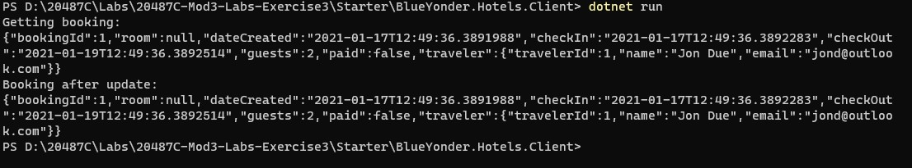

# Module 3: Creating and Consuming ASP.NET Core Web APIs 

# Lab: Creating an ASP.NET Core Web API

1. **Nombres y apellidos:** Francisco Javier Moreno Quevedo
2. **Fecha:** 17/01/2021
3. **Resumen del Ejercicio:**  Completar el proyecto para poder devolver los datos
4. **Dificultad o problemas presentados y como se resolvieron:** Ninguna


#### Exercise 3: Create a client

- Creamos el proyecto **BlueYonder.Hotels.Client** desde la consola. Lo añadimos a la solucion añadimos los paquetes necesarios y restauramos

  ```bash
   dotnet new console --name BlueYonder.Hotels.Client
  ```

  ```bash
   dotnet sln Mod3Lab1.sln add BlueYonder.Hotels.Client\BlueYonder.Hotels.Client.csproj
  ```

  ```bash
   dotnet add package Microsoft.AspNet.WebApi.Client --version=5.2.6
   dotnet restore
  ```

- Añadimos la referencia al proyecto DAL

  ```xml
   <ItemGroup>
       <ProjectReference Include="..\DAL\DAL.csproj" />
   </ItemGroup>
  ```

- Indicamos la version de C#

```xml
<PropertyGroup>
 <LangVersion>7.3</LangVersion>
</PropertyGroup>
```

- En **Program.cs** añdimos 

```cs
using DAL.Models;
using System;
using System.Net.Http;
using System.Threading.Tasks;

namespace BlueYonder.Hotels.Client
{
    class Program
    {
        static async Task Main(string[] args)
        {
            using (HttpClient client = new HttpClient())
            {
                HttpResponseMessage message = await client.GetAsync("http://localhost:5000/api/HotelBooking/1");
                Console.WriteLine("Getting booking:");
                string resultAsString = await message.Content.ReadAsStringAsync();
                Console.WriteLine(resultAsString);

                Booking booking = await message.Content.ReadAsAsync<Booking>();
                booking.Paid = false; 
                
                message = await client.PutAsJsonAsync("http://localhost:5000/api/HotelBooking/1", booking);
                resultAsString = await message.Content.ReadAsStringAsync();
                Console.WriteLine("Booking after update:");
                Console.WriteLine(resultAsString);
            }
        }
    }
}
```

- Ejecutamos el proyecto **BlueYonder.Hotels.Service**,
- Ejecutamos el proyecto **BlueYonder.Hotels.Client**

